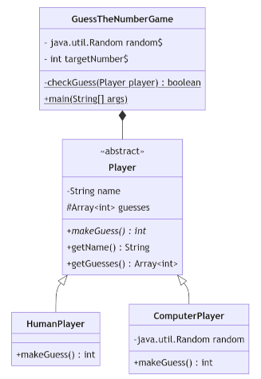
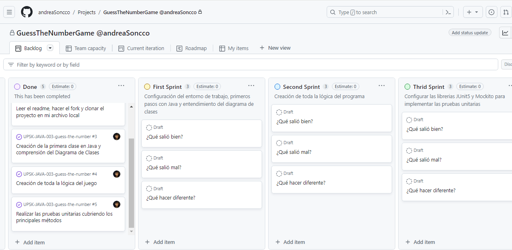
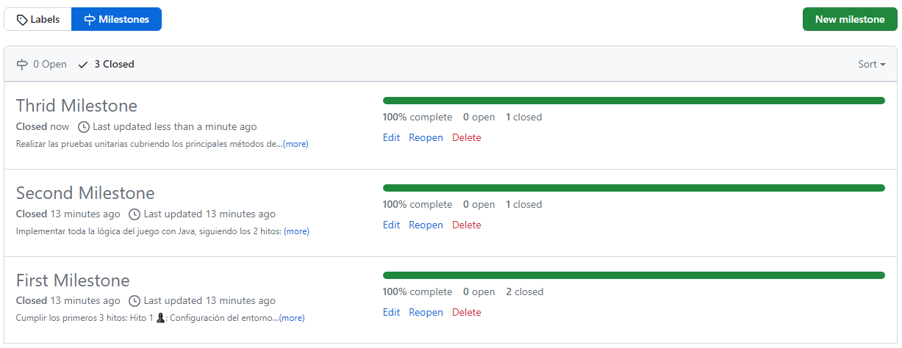

# GUESS THE NUMBER GAME (Java) 🎮🎯 - "Adivina el número" 🎲🔮

Se puede empezar este juego corriendo la clase GuessTheNumberGame y seguir la partida en la consola ▶️✔️

## Índice

* [1. Preámbulo](#1-preámbulo)
* [2. Definición del producto](#2-definición-del-producto)
* [3. Aspectos Técnicos y Documentación del Proyecto](#3-documentación-de-la-interfaz-de-programación-de-aplicaciones-api)
* [4. Instrucciones del Juego](#4-instrucciones-de-instalación-y-uso)
* [5. Proceso de Diseño y Desarrollo](#5-proceso-de-diseño-y-desarrollo)
* [6. Herramientas de Elaboración](#6-herramientas-de-elaboración)

***

## 1. PREÁMBULO.

En la actualidad, Java es uno de los lenguajes de programación más
utilizados en el mundo. A pesar de la diversidad de plataformas y herramientas disponibles,
es fundamental tener una base sólida en los conceptos fundamentales de Java y en la
programación orientada a objetos (OOP). El objetivo de este proyecto es introducirte al
mundo de Java a través de un juego simple y divertido.

## 2. DEFINICIÓN DEL PRODUCTO.

Es un juego interactivo que se desarrolla en el terminal, donde la jugadora y el ordenador
se turnan para intentar adivinar un número aleatorio entre 1 y 100. Deben tener en cuenta
la tentativa anterior, si fue "muy alta" o "muy baja".

## 3. ASPECTOS TÉCNICOS Y DOCUMENTACIÓN DEL PROYECTO.

En el presente proyecto se implementan 4 clases en Java para darle funcionalidad a todo el
programa, en la clase GuessTheNumberGame se ejecuta el método `main` y en la otra clase abstracta
Player se declaran los atributos y los principales métodos a emplear, las otras dos subclases
HumanPlayer y ComputerPlayer son las que heredan el método estático `makeGuess`.

Para poder trabajar de forma ordenada se crean tres métodos en la clase GuessTheNumberGame que
seguiran paso a paso todo el procedimiento del juego, empezando por el método `checkGuess` donde
se compara el número objetivo con el número de la jugadora, luego le sigue el método `HighOrLow`
que se encarga de devolver la cadena de texto con la información si la cantidad fue muy alta o
muy baja, el tercer método es `playGame` donde se ejecuta la mayor parte de la lógica del programa
ya que establece el numero de intentos y alterna las partidas entre la jugadora y la máquina.

Parte importante de la funcionalidad se logro aplicando condicionales y bucles

Al final del proyecto se hicieron pruebas unitarias con las librerias `JUnit5` y `Mockito` para testear
los métodos makeGuess y main.

## 4. INSTRUCCIONES DEL JUEGO.

### Inicia el Juego 👩🏽‍💻

Se puede empezar este juego corriendo la clase GuessTheNumberGame ▶️. Seguidamente aparecera en la consola
el siguiente mensaje:

```Para empezar a jugar escribe tu nombre: ```

Escribe tu nombre y te saldra el siguiente mensaje a continuación:

```Adivina el número aleatorio entre 0 y 100: ```

¡Ahora! comienza una partida con la máquina 😉🍀

## 5. PROCESO DE DISEÑO Y DESARROLLO.

### 5.1. Planificación y Diseño. ✏️

Para realizar el proyecto me organice utizando Github Project. De esta manera planifique mejor el tiempo
y dividi el trabajo en metas por sprint usando `milestones` que contienen `issues` o tareas más pequeñas.
Aplique metodología SCRUM de trabajo ágil.

Para el desarrollo me guie del siguiente Diagrama de Clases o Lenguaje de Modelado Unificado 💡 que me
ayudo a poder ordenarme respecto a las funciones o métodos que se necesitaban crear y codear la totalidad
del proyecto.



### 5.2. Desarrollo del Proyecto.

El desarrollo total de la libreria tomo tres sprints y al cabo de cada uno fui tomando en cuenta el
feedback recibido para hacer mejoras, a continuación pasaré a mostrar la imagen de mi tablero en 
Github Project donde guió el desarrollo por 7 hitos:

- Hito 1 ♟: Configuración del entorno de trabajo con Java y el IDE IntelliJ

- Hito 2 💫: Creación de la primera clase del proyecto que contenga el método main

- Hito 3 📚: Comprensión del Diagrama de Clases

- Hito 4 ⭐️: Implementación de las clases que representan a la jugadora humana y la lógica para generar
             un número aleatoreo y verificar si el usuario asertó.

- Hito 5 ⌨️: Creacción de la clase que representa a la segunda jugadora (la computadora) y el desarrollo
             de la lógica para alternar el juego entre ambas.

- Hito 6 🌼: Configuración de las librerias JUnit5 y Mockito para los tests

- Hito 7 ⚡️: Diseño de las pruebas unitarias para cubrir la lógica del juego

**Tablero de Github Project**



**Cuadro de Milestones**



## 6. HERRAMIENTAS DE ELABORACIÓN

👩‍🔧💻
- Java: para codear el proyecto haciendo uso de clases como `Random` y `Scanner`
- Programación Orientada a Objetos (OOP): para aplicar las propiedades de encapsulamiento, abstracción, herencia y polimorfismo
- Terminal de Git Bash o PowerShell
- JUnit5: para generar las pruebas unitarias
- Mockito: para mockear algunas clases
- Github Project: para planificar el tiempo y dividir las tareas
- Diagrama de Clases o Lenguaje de Modelado Unificado (ULM)